# LEAD CAPTURE & FOLLOW-UP AUTOMATION SYSTEM

An AI-powered automation workflow that captures incoming leads and automates follow-up communication to help businesses improve response consistency and reduce missed sales opportunities.

This project demonstrates how AI automation can streamline lead management workflows by transforming customer inquiries into organized, actionable sales processes with minimal manual intervention.

---

## Overview

Businesses that rely on inbound leads often struggle with delayed response times, inconsistent follow-up communication, and disorganized customer data. As lead volume increases, manually managing inquiries becomes inefficient and increases the risk of missed sales opportunities.

This automation system helps businesses streamline lead management by capturing incoming inquiries, organizing lead information automatically, and triggering immediate follow-up communication through automated workflows.

The workflow reduces manual administrative work while improving response consistency, lead organization, and operational efficiency across customer intake processes.

---

## Business Problem

Businesses that depend on inbound customer inquiries often struggle to manage leads quickly and consistently.

This creates several operational challenges:

- Delayed responses to new inquiries
- Missed follow-up opportunities
- Disorganized lead tracking
- Inconsistent communication workflows
- Manual data entry and administrative tasks
- Difficulty scaling lead management processes

A scalable automated solution was needed to capture leads, organize customer information, and automate follow-up communication efficiently.

---

## Solution

Built an automated workflow that:

- Captures incoming lead submissions automatically
- Organizes customer information into structured records
- Processes lead data through Make automation
- Sends automated customer confirmation emails
- Sends internal business lead notifications
- Stores lead information for ongoing tracking and management
- Reduces manual administrative workload
- Improves response consistency and lead engagement

---

## Workflow Breakdown

1. A customer submits an inquiry through a Google Form

2. Lead data is automatically captured and stored in Google Sheets

3. Make monitors the spreadsheet for new lead submissions

4. Lead information is processed and routed automatically

5. A customer confirmation email is sent instantly through Gmail

6. An internal lead notification email is sent to the business

7. Processed leads are organized for future tracking and follow-up

---

## Value Added

- Automates lead intake and follow-up workflows
- Improves lead response speed and consistency
- Reduces missed customer opportunities
- Organizes lead information into structured records
- Minimizes manual administrative tasks
- Demonstrates practical workflow automation for small businesses

---

## Tech Stack

- Make (Integromat)
- Google Forms
- Google Sheets
- Gmail
- Workflow Automation
- Lead Management Automation
- No-Code Automation
- Automated Email Routing
- Data Processing Automation

---

## Workflow Screenshots

### Workflow Architecture Diagram

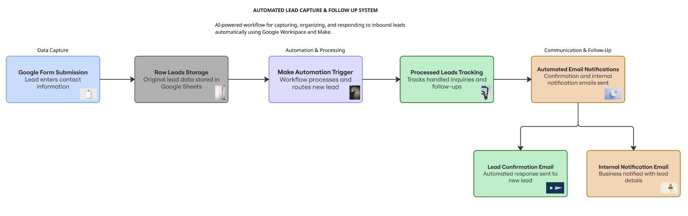

---

### Google Form Lead Capture

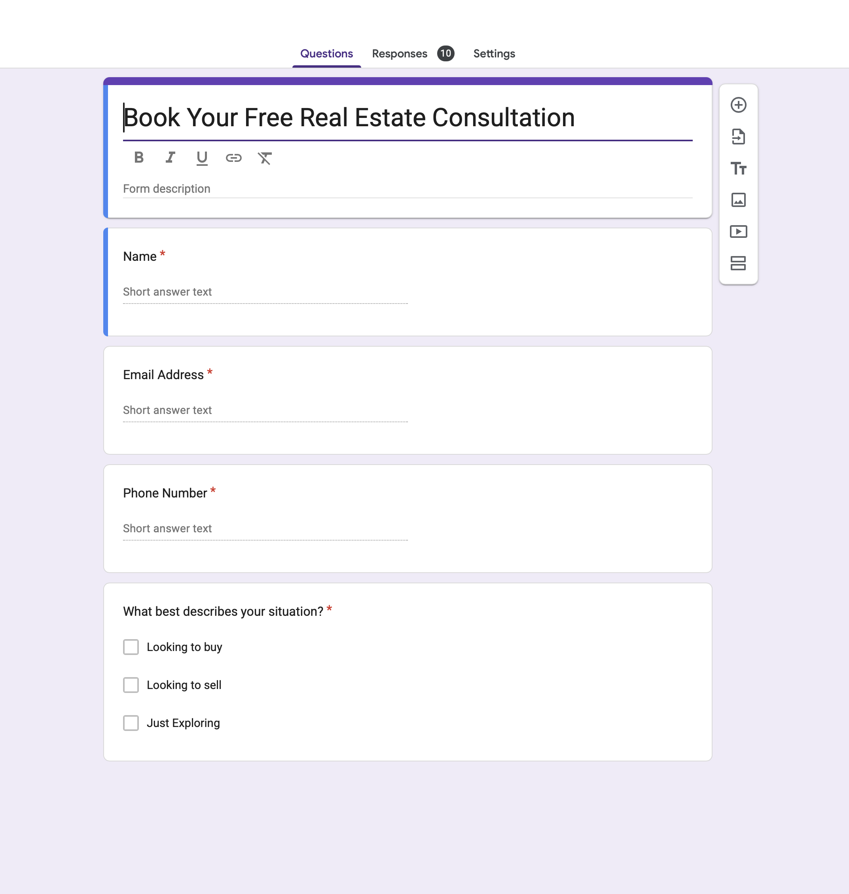

---

### Raw Leads Storage Sheet

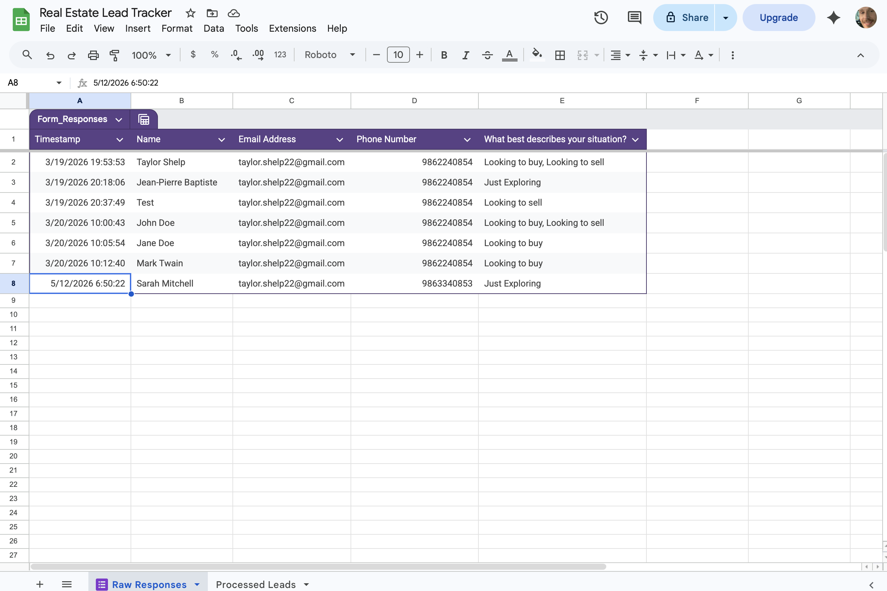

---

### Make Form Trigger Configuration

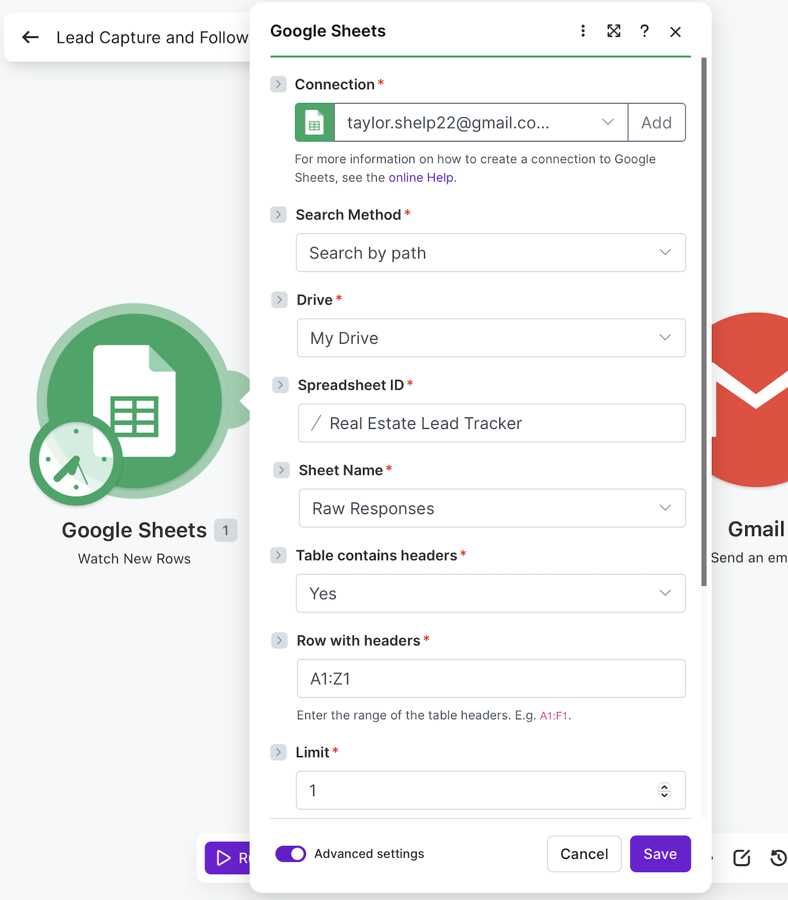

---

### Make Workflow Overview

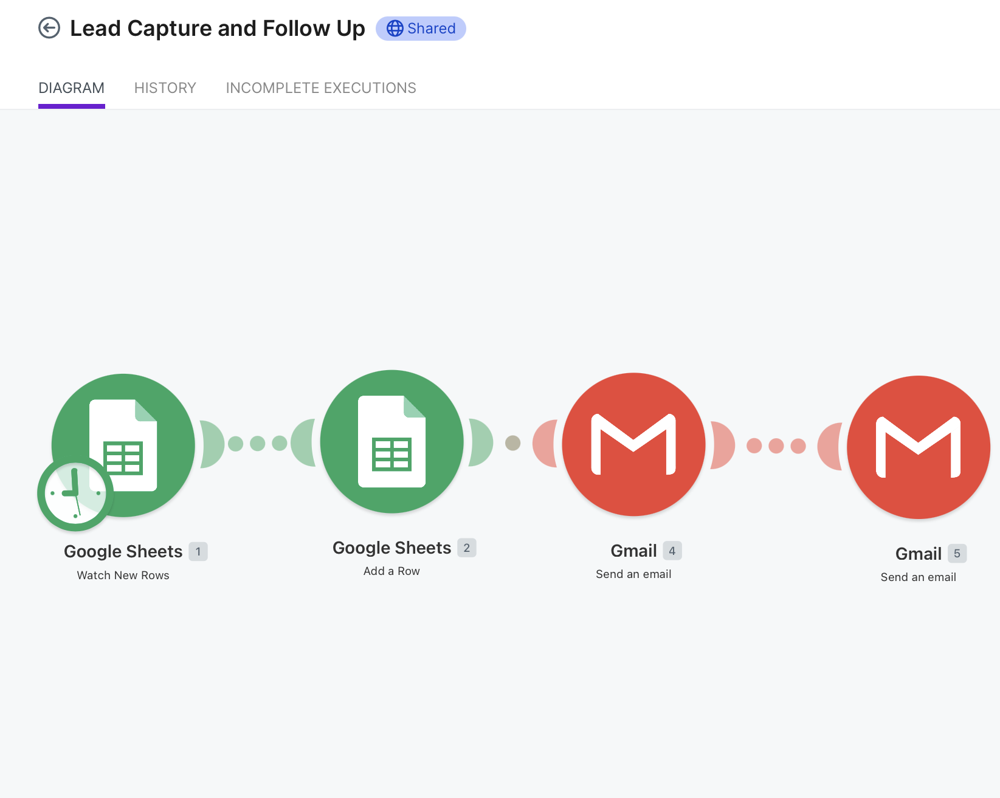

---

### Processed Leads Tracking Step

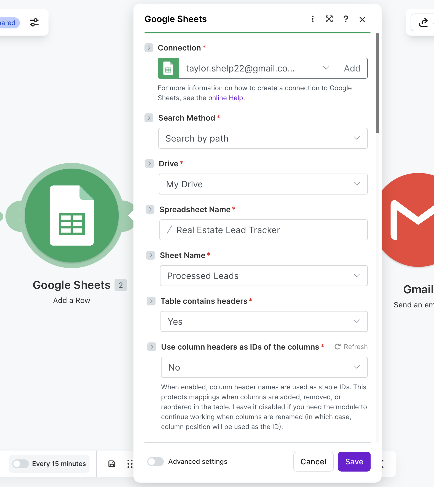

---

### Processed Leads Google Sheet

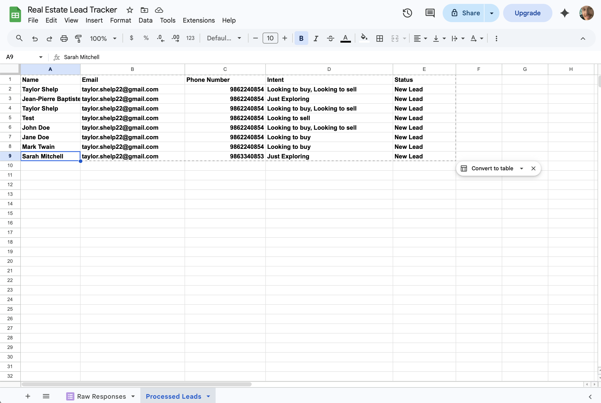

---

### Gmail Lead Confirmation Configuration

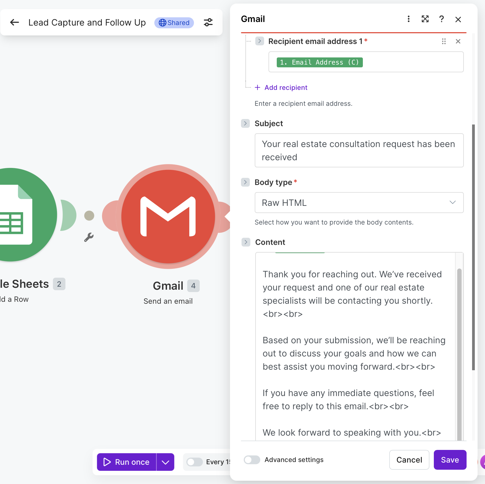

---

### Gmail Internal Notification Configuration

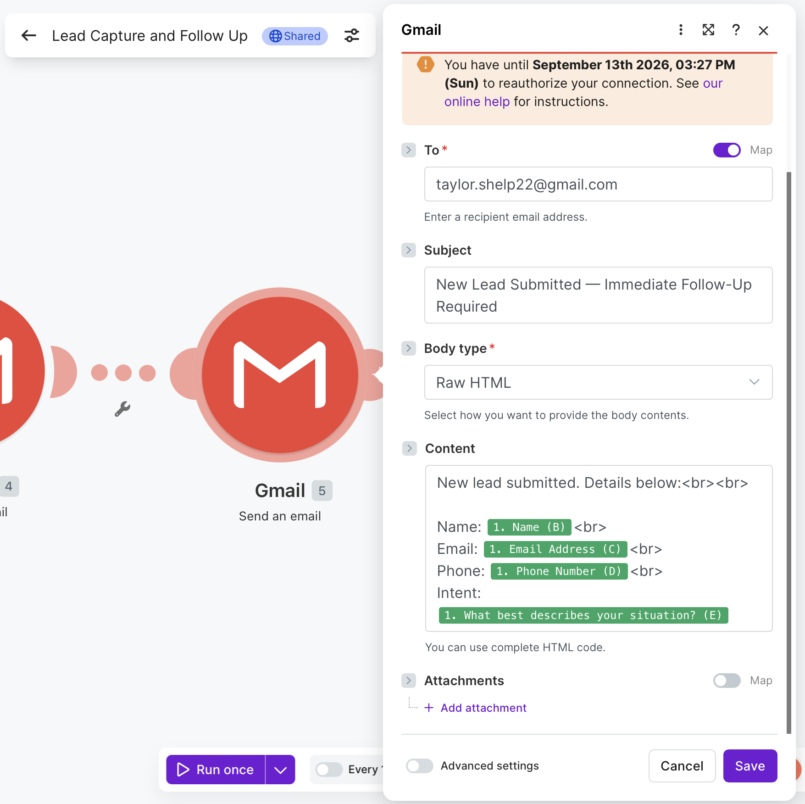

---

### Automated Lead Confirmation Email

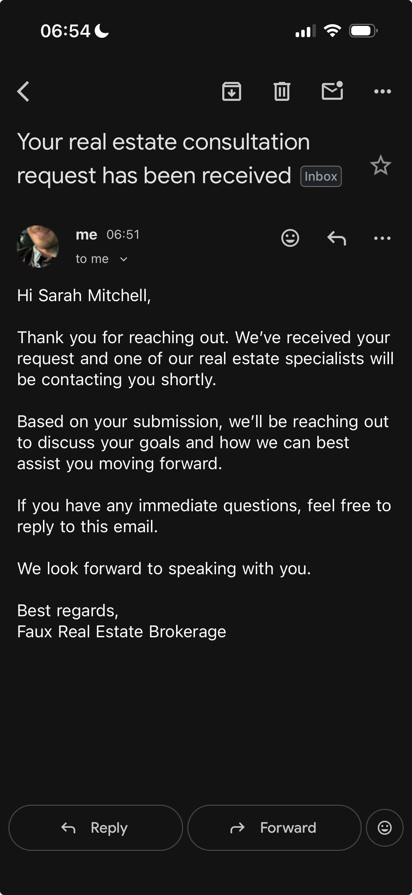

---

### Internal Lead Notification Email

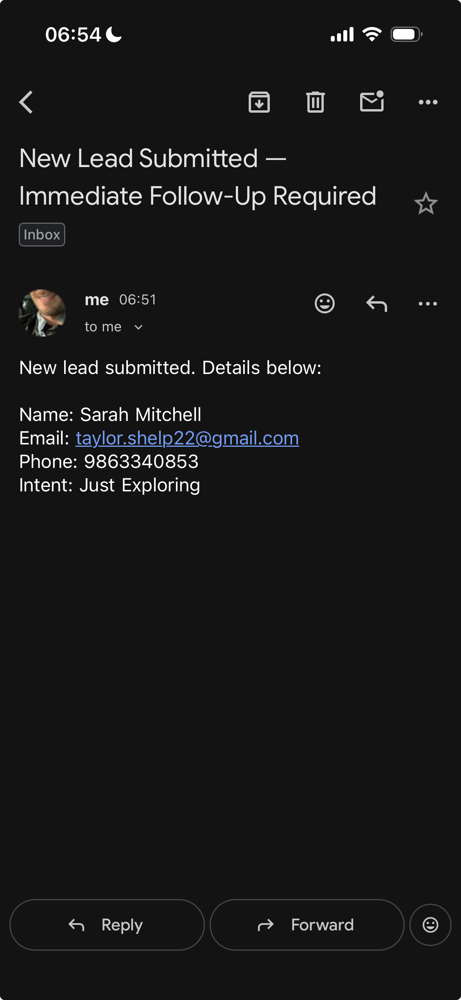

---

## Future Improvements

Potential future enhancements include:

- CRM integration
- SMS follow-up automation
- AI-powered lead scoring
- Multi-step nurture campaigns
- Slack sales notifications
- Appointment booking integration

---

## Project Status

Completed as a functional automation workflow for lead capture, customer follow-up, internal notifications, and lead tracking management.
